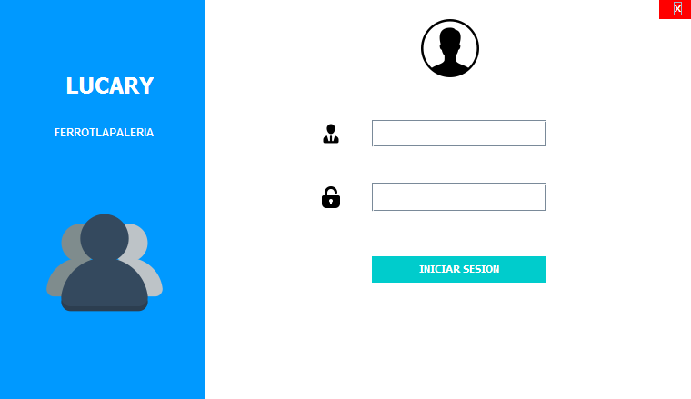

# LUCARY SYSTEM -JECK1997

Desarrollo de software implementado java con la finalidad de aprender mediante la practica.

### Implementacions y funcionalidades version 0.0.1
<ol>
    <li>OPCION DE VENTAS :
        <ul>
            <li>Agregar nueva venta</li>
            <li>Consultar ventas</li>
        </ul>
    </li>
    <li>OPCION DE PRODUCTOS :
        <ul>
            <li>Agregar nuevo producto</li>
            <li>Consultar productos</li>
        </ul>
    </li>
    <li>OPCION DE USUARIO :
        <ul>
            <li>Agregar nuevo usuario</li>
            <li>eliminar usuario</li>
        </ul>
    </li>
    <li>OPCION DE SALIR :
        <ul>
            <li>salir de la sesion</li>
            <li>Salir del software</li>
        </ul>
    </li>
</ol>

### Primeros diseños del software
>Login de Acceso

>Pagina principal del software

Desarollo en java creada por JESUS CANUL JECKA